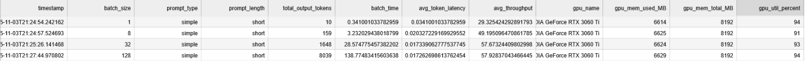

# LLaMA-Token-Generation-Latency
This project benchmarks local large language model (LLM) performance using [Ollama](https://ollama.ai/) across different *batch sizes* and *prompt types*.  
It measures key metrics like token latency, throughput, and GPU utilization to analyze model efficiency and scalability.

---

## Requirements
Ensure the following are installed:

- **Python 3.9+**
- **Ollama Desktop** (or CLI) — [Download here](https://ollama.ai/download)
- **Jupyter Notebook**
- **NVIDIA GPU** (optional but recommended for GPU stats as that was the types of GPUs used)
- Python libraries:

```bash
pip install pandas numpy psutil pynvml tqdm
```

---
## Project Structure
```
LLaMA-Token-Generation-Latency/
├── prompts/
│   ├── simple_short.txt
│   ├── simple_long.txt
│   ├── moderate_short.txt
│   ├── moderate_long.txt
│   ├── complex_short.txt
│   ├── complex_long.txt
├── results/
│   └── 3060_llama_batch_latency.csv
│   └── 3060_llama_batch_summary.csv
├── benchmark.ipynb
└── README.md
```
prompts/ – text files with different prompt categories (simple vs. complex, short vs. long).

results/ – CSV files for storing benchmark results.

benchmark_notebook.ipynb – main benchmarking script.

## Procedure
1) The notebook first utilizes a warmup to stabilize latency
2) Prompts are loaded into a directory and grounded by length and type
3) Benchmarking is ran for each batch size and prompt type (also options for single cycle or random prompts to simulate real-world workload)
4) For each run, the following metrics are recorded:
```
batch_size
prompt_type
prompt_length
total_output_tokens
batch_time
avg_token_latency
avg_throughput
GPU info: gpu_name, gpu_mem_used_MB, gpu_util_percent
Timestamp and other metadata
```
5) Results are then saved for each individual prompt (3060_llama_batch_latency.csv) and for batches (3060_llama_batch_summary.csv) for consistent logging and debugging.

## Running the project
1) Ensrue Ollama Desktop is running (or run *ollama serve* in CLI)
2) Open the Jupyter Notebook from command line:
```jupyter notebook benchmark_notebook.ipynb```
3) Configuration of parameters can be done in cell 11 for MIXED PROMPTS (real-world) VS HOMOGENEOUS (only one type). This block:
 ```
# CONFIGURATION FOR MIXED PROMPTS VS HOMOGENEOUS

# For a mixed batch (all prompt types), "real world" workload 
# csv_file = MIXED_CSV
# csv_type = "mixed"
# homogeneous_key = None  # Not used for mixed runs

# For homogeneous batch (only one type/length), experiment workload 
csv_file = HOMOGENEOUS_CSV
csv_type = "homogeneous"
homogeneous_key = "simple_short"  # e.g., simple_short, moderate_long, etc.
```
4) For configuration loop repititions or single runthrough, changes can be made near the bottom of cell 15. This block:
```
# BENCHMARKING PARAMETERS
model_name = "llama3"  # change as needed
batch_sizes = [1, 8, 32, 128]

# Warm-up
warmup_model(model_name)

# Run full experiment, singular
#df_results = run_full_experiment(
#    model_name=model_name,
#    batch_sizes=batch_sizes,
#    prompt_bank=prompt_bank,
#    csv_file=csv_file,
#    csv_type=csv_type,
#    homogeneous_key=homogeneous_key
#)

# Multiloop experiment 
# Number of repeats per prompt type
num_repeats = 50   # adjust as needed

Loop over prompt types and run
for key in homogeneous_keys:
    print(f"\n=== Running homogeneous tests for {key} ===\n")
    for i in range(num_repeats):
        print(f"Run {i+1}/{num_repeats} for {key}")
        df_results = run_full_experiment(
            model_name=model_name,
            batch_sizes=batch_sizes,
            prompt_bank=prompt_bank,
            csv_file=csv_file,
            csv_type="homogeneous",
            homogeneous_key=key
        )
        print(f"Completed {key} run {i+1}/{num_repeats}\n")
```
5) Run all notebook cells sequentially.
6) After completion, results are stored in results/.

## Example Output


